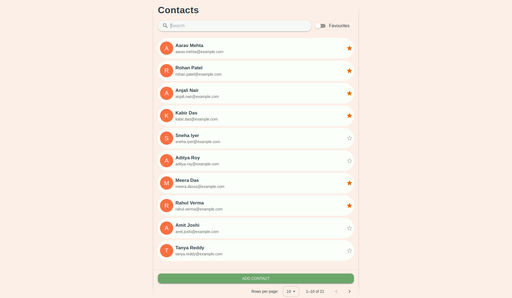
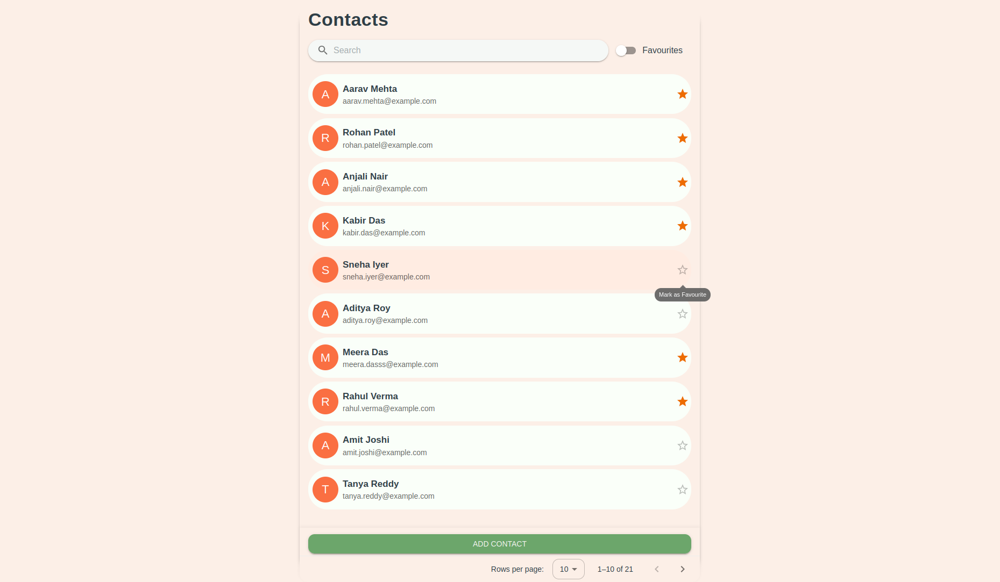
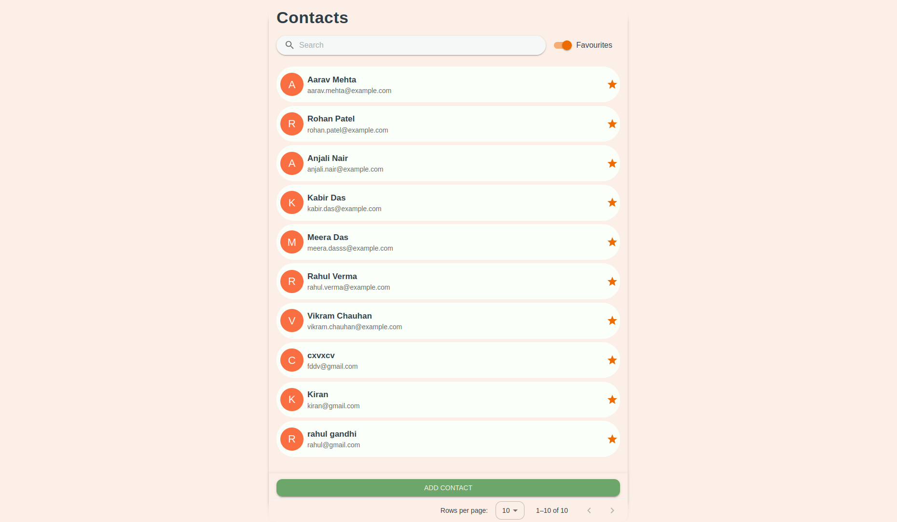
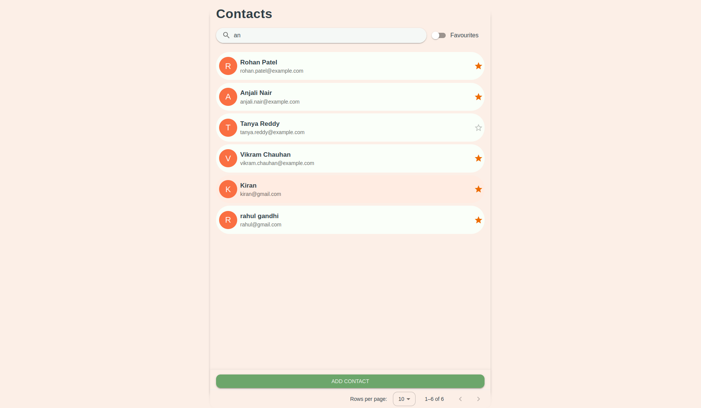
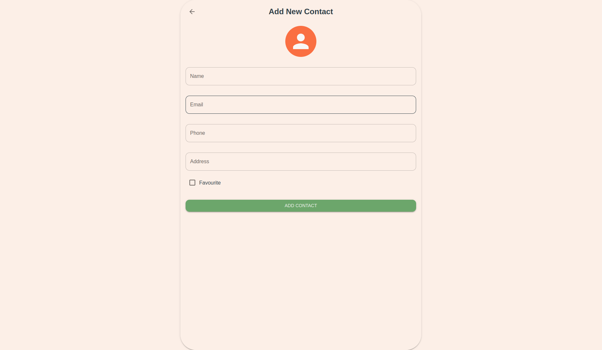
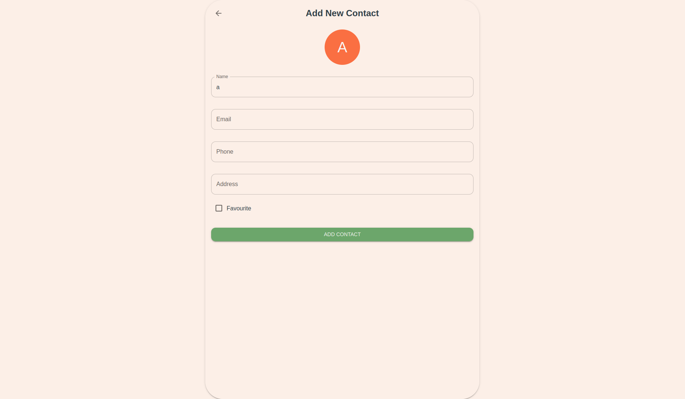
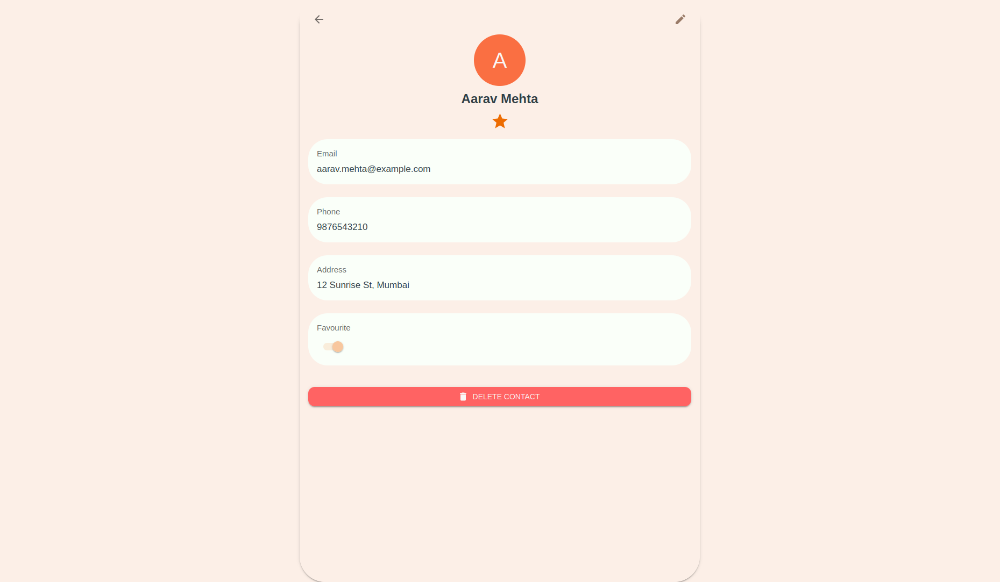
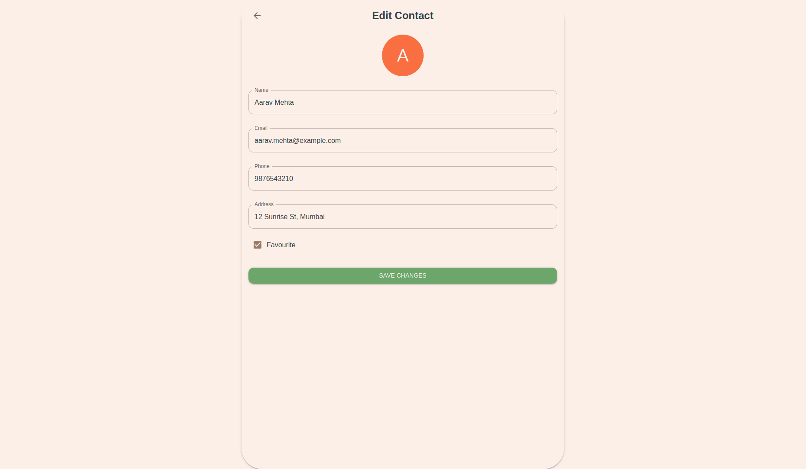

# Contact Manager

This is a single-page web application for managing a list of contacts. It's built with a modern React stack, focusing on a clean component structure, efficient state management, and a great user experience.

The application allows users to view, add, edit, and delete contacts. It also includes features like server-side searching, filtering, and pagination to handle data efficiently.

## Project Highlights

*   **Modern React Stack:** Utilizes React v18, Zustand, TanStack React Query, and React Hook Form.
*   **Efficient Data Handling:** Implements server-side pagination, searching, and filtering, ensuring the app remains fast and responsive even with a large number of contacts.
*   **Robust State Management:** Cleanly separates client-side UI state (like search input and toggles) from server-side cache (the contact list itself).
*   **Reusable Component Architecture:** Features a well-organized structure with reusable components like `ContactCard` and a versatile `ContactForm` for both adding and editing.
*   **Enhanced User Feedback:** Provides a global loading spinner for all background data operations and displays clear, non-intrusive snackbar notifications for API errors.
*   **Optimized Performance:** The search input is debounced to prevent excessive API calls, and `useCallback` is used to optimize event handlers.

## Tech Stack

*   **React (v18)**
*   **Zustand** (for client-side UI state)
*   **TanStack React Query** (for server state management and caching)
*   **React Hook Form** (for form handling and validation)
*   **Material-UI (MUI)** (for the component library and styling)
*   **Axios** (for making API requests)
*   **JSON Server** (for the mock API backend)
*   **Concurrently** (to run frontend and backend servers with a single command)

## How to Run Locally

Follow these instructions to get the project running on your local machine.

### Prerequisites

*   Node.js (v18 or later recommended)
*   npm or yarn

### Installation & Setup

1.  **Clone the repository:**
    ```sh
    git clone <your-repository-url>
    cd contact-manager
    ```

2.  **Install dependencies:**
    This will install the dependencies for both the React app and the JSON server.
    ```sh
    npm install
    ```

3.  **Start the application:**
    This command uses `concurrently` to start both the React development server and the `json-server` mock API at the same time.
    ```sh
    npm start
    ```

4.  **Open in your browser:**
    *   The Contact Manager application will be running at `http://localhost:3000`.
    *   The mock API server will be running at `http://localhost:3001`.

## How the Solution was Approached

The architecture of this application was designed to be scalable, maintainable, and efficient, adhering to modern best practices for React development.

### State Management Strategy

The core of the application's architecture is a clear separation between client-side and server-side state.

*   **Client State (Zustand):** Zustand was chosen for its simplicity and performance. It is used to manage UI-specific state that doesn't need to be persisted on the server, such as:
    *   The current value of the search input field.
    *   The state of the "Show Favourites Only" toggle.
    *   The ID of the currently selected contact to be viewed on the details page.
    This approach keeps the UI state management lightweight and decoupled from the server cache.

*   **Server State (TanStack React Query):** React Query acts as the source of truth for all data that originates from our API. It handles all the complexities of server-side state:
    *   **Fetching:** The `useContactsQuery` hook is the central point for fetching contacts. It dynamically includes parameters for pagination, searching, and filtering, and its query key is structured to automatically trigger refetches when these parameters change.
    *   **Mutations:** `useAddContact`, `useUpdateContact`, and `useDeleteContact` hooks manage all API mutations.
    *   **Cache Invalidation:** On a successful mutation (e.g., after adding or deleting a contact), React Query automatically invalidates the relevant contact list queries. This ensures the UI always displays the most up-to-date information without manual data wrangling.

### Component Structure

The project is organized into two main categories: `pages` and `components`.

*   **Pages (`src/pages`):** These are top-level components that represent the main views of the application, such as `ContactsPage` (the main list view) and `ContactDetailsPage`.
*   **Components (`src/components`):** These are smaller, reusable pieces of UI that are composed together to build pages. Key examples include:
    *   `ContactCard`: A self-contained card for displaying a single contact's summary.
    *   `ContactForm`: A highly reusable form, powered by React Hook Form, that is used for both adding a new contact and editing an existing one.
    *   `SearchBar`, `Pagination`, `FavouritesToggle`: Specialized components that were broken out from the main list to improve code clarity and reusability.

## Extra Features and Highlights

Beyond the core requirements, several features were added to improve the application's quality and user experience.

*   **Global Feedback System:** A `GlobalSpinner` provides a non-intrusive loading indicator during any background API request, and an `ErrorSnackbar` provides clear feedback if an operation fails. This ensures the user is never left wondering about the application's state.
*   **Optimized Performance:** `useCallback` is used for event handlers passed down to child components. This prevents the creation of new functions on every render, optimizing performance by reducing unnecessary re-renders of child components.
*   **Dynamic Headings:** The "Add Contact" and "Edit Contact" pages feature clear, dynamic headings, improving context and overall user experience.

## Screenshots

*   **Contact List:**



*   **Mark Contact as Favourite:**



*   **Favourite Contact List:**



*   **Search Contact:**



*   **Add Contact:** This page opens when the 'Add Contact' button is clicked.



*   **Add Contact Name Initial:** When we type the contact name, the first letter of the name is used as the avatar.



*   **Contact Detail:**



*   **Edit Contact:**



*   **Delete Contact:**


